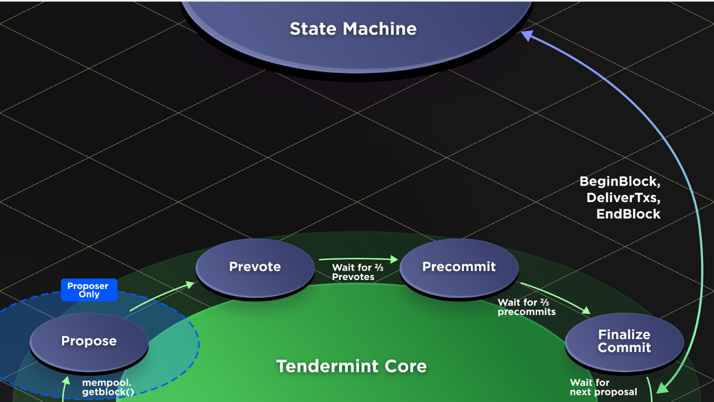
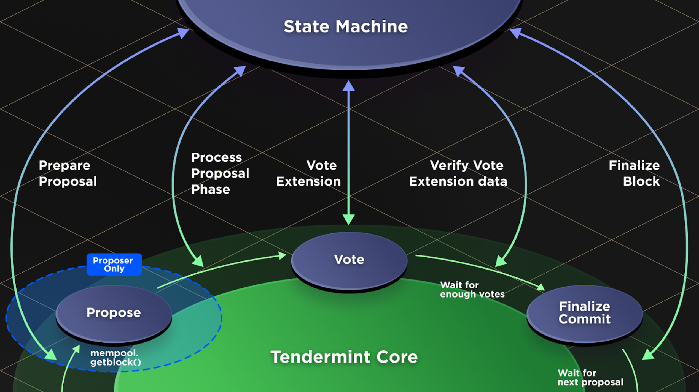

# RFC 004: ABCI++

## Changelog

- January 11, 2020: initialized

## Author(s)

- Dev (@valardragon)
- Sunny (@sunnya97)

## Context

ABCI is the interface between the consensus engine and the application.
It defines when the application can talk to consensus during the execution of a blockchain.
At the moment, the application can only act at one phase in consensus, immediately after a block has been finalized.

This restriction on the application prohibits numerous features for the application, and scalability improvements that are now better understood than whan ABCI was first written.
We propose introducing three new phases to ABCI to enable these new features.

#### Prepare Proposal phase

This phase aims to allow the block proposer to perform more computation, to reduce load on all other full nodes, lite clients in the network.
It is intended to enable features such as batch optimizations on the transaction data (e.g. signature aggregation, zk rollup style validity proofs, etc.), enabling stateless blockchains with validator provided authentication paths, etc.

This new phase will only be executed by the block proposer. The application will take in the block header and raw transaction data output by the consensus engine's mempool. It will then return block data that is prepared for gossip on the network, and additional fields to include into the block header.

#### Process Proposal Phase

This phase aims to allow applications to determine validity of a new block proposal, and execute computation on the block data, prior to the blocks finalization.
It is intended to enable applications to reject block proposals with invalid txs, invalid 'additional security protocols', and to enable alternate pipelined execution models. (Such as Ethereum-style immediate execution)

This phase will be executed by all full nodes upon receiving a block.

#### Vote Extension Phase

This adds an app-determined data field that every validator must include with their vote, and in the header.

We include a more detailed list of features / scaling improvements that are blocked, and which new phases resolve them at the end of this document.

 | 
On the left is the existing definition of ABCI, and on the right is the proposed ABCI++.

## Proposal

Below we suggest an API to add these three new phases. We list the ABCI phases in a suggested implementation order and in a suggested implementation order, to ensure auditablity of each phases implementation.

### Process Proposal

Process proposal sends the block data to the state machine, prior to running the last round of votes on the state machine. This enables features such as allowing validators to reject a block according to whether state machine deems it valid, and changing block execution pipeline.

We introduce three new methods,
```rust
fn VerifyHeader(header: Header) -> ResponseVerifyHeader
fn ProcessProposal(block: Block) -> ResponseProcessProposal
fn RevertProposal(height: usize, round: usize)
```
where
```rust
struct ResponseVerifyHeader {
    accept_header: bool,
    evidence: Vec<Evidence>
}
struct ResponseProcessProposal {
    accept_block: bool,
    evidence: Vec<Evidence>
}
```

Upon receiving a block header, every validator runs `VerifyHeader(header)`. The reason for why `VerifyHeader` is split from `ProcessProposal` is due to the later sections for Preprocess Proposal and Vote Extensions, where there may be application dependent data in the header that must be verified before accepting the header. If the returned `ResponseVerifyHeader.accept_header` is false, then the validator must precommit nil on this block, and reject all other precommits on this block. `ResponseVerifyHeader.evidence` is appended to the validators local `EvidencePool`.

Upon receiving an entire block proposal (in the current implementation, all "block parts"), every validator runs `ProcessProposal(block)`. If the returned `ResponseProcessProposal.accept_block` is false, then the validator must precommit nil on this block, and reject all other precommits on this block. `ResponseProcessProposal.evidence` is appended to the validators local `EvidencePool`.

Once a validator knows that consensus has failed to be achieved for a given block, it must run `RevertProposal(block.height, block.round)`, in order to signal to the application to revert any potentially mutative state changes it may have made. In Tendermint, this occurs when incrementing rounds.

The application is expected to cache the block data for later execution.

This approach changes the amount of time available for the consensus engine to deliver a block's data to the state machine. Before, the block data for block N would be delivered to the state machine upon receiving a commit for block N and then be executed. The state machine would respond after executing the txs and before prevoting. The time for block delivery from the consensus engine to the state machine after this change is the time of receiving block proposal N to the to time precommit on proposal N. It is expected that this difference is unimportant in practice, as this time includes one round of p2p communication for prevoting, which is expected to be significantly less than the time for the cosnensus engine to deliver a block to the state machine.

### DeliverTx rename to FinalizeBlock

After implementing `ProcessProposal`, txs no longer need to be delivered during the block execution phase. Instead, they are already in the state machine. Thus `BeginBlock, DeliverTx, EndBlock` can all be replaced with a single ABCI method for `ExecuteBlock`. Internally the application may still structure its method for executing the block as `BeginBlock, DeliverTx, EndBlock`. However, it is overly restrictive to enforce that the block be executed after it is finalized. There are multiple other, very reasonable pipelined execution models one can go for. So instead we suggest calling this succession of methods `FinalizeBlock`. We propose the following API

Replace `BeginBlock, DeliverTx, EndBlock` with the following method
```rust
fn FinalizeBlock() -> ResponseFinalizeBlock
```
where `ResponseFinalizeBlock` has the following API, in terms of what already exists
```rust
struct ResponseFinalizeBlock {
    updates: ResponseEndBlock,
    tx_results: Vec<ResponseDeliverTx>
}
```
`ResponseEndBlock` will be renamed to `ConsensusEngineUpdates` and `ResponseDeliverTx` should be renamed to `ResponseTx`.

### Preprocess Proposal

*Note, APIs in this section will change after Vote Extensions, we list the adjusted APIs further in the proposal. We suggest Preprocess Proposal in standalone form first, for implementation order purposes*

Preprocess proposal allows the block proposer to perform application-dependent batch optimizations to a block, which is a key optimization for scaling. This introduces the following method
```rust
fn PreprocessProposal(Block) -> BlockData
```
where `BlockData` is a type alias for `Vec<Tx>`.

The application may read the entire block proposal, and mutate the block data field. Mutated transactions will still get removed from the mempool later on, as the mempool rechecks all transactions after a block is executed.

It is assumed that the IPC overhead for doing a round trip communication of the block data between the consensus engine and the state machine is negligible compared to p2p gossip time. This has not been experimentally validated yet, if this turns out to not be the case, we can implement this method to do the actual data delivery in chunks. (e.g. deliver the header, evidence first. Then send over block data chunk by chunk)

### Vote Extensions

Vote Extensions allow applications to force their validators to do more than just validate within consensus. This is done by allowing the application to add more data to their votes, in the final round of voting. (Namely the precommit)

First we discuss the API changes to the vote struct directly
```rust
fn ExtendVote(raw_tm_vote_data: CanonicalVote) -> (UnsignedAppVoteData, SelfAuthenticatingAppData)
fn VerifyVoteExtension(signed_app_vote_data: Vec<u8>, self_authenticating_app_vote_data: Vec<u8>) -> bool
```

There are two types of data that the application can enforce validators to include with their vote. There is data that the app needs the validator to sign over in their vote, and there can be self-authenticating vote data. Self-authenticating here means that the application upon seeing these bytes, knows its valid, came from the validator and is non-malleable.

The `CanonicalVote` struct will acommodate the `UnsignedAppVoteData` field by adding another string to its encoding, after the `chain-id`. This should not interfere with existing hardware signing integrations, as it does not affect the constant offset for the `height` and `round`, and the vote size does not have an explicit upper bound. (So adding this unsigned app vote data field is equivalent from the HSM's perspective as having a superlong chain-ID)

RFC: Please comment if you think it will be fine to have elongate the message the HSM signs, or if we need to explore pre-hashing the app vote data.

The flow of these methods is that when a validator has to precommit, Tendermint will first produce a precommit canonical vote without the application vote data. It will then pass it to the application, which will return unsigned application vote data, and self authenticating application vote data. It will bundle the `unsigned_application_vote_data` into the canonical vote, and pass it to the HSM to sign. Finally it will package the self-authenticating app vote data, and the `signed_vote_data` together, into one final Vote struct to be passed around the network.

<WIP Finish talking about the vote flow, give structs for Vote, Commit, Header, with and w-o batch optimizations. Decide API for preprocess proposal dealing with the Commit>

## Status

Proposed

## Consequences

### Positive

### Negative

### Neutral

## References

### Short list of blocked features & scaling improvements